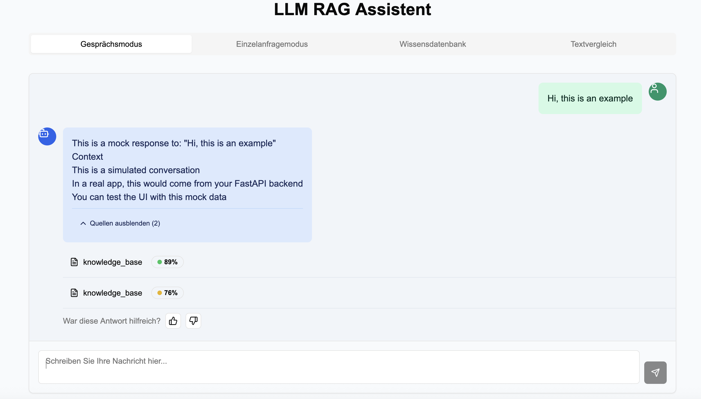

# LLM RAG Frontend

[](https://nextjs.org/)
[](https://react.dev/)
[](https://www.typescriptlang.org/)
[](https://tailwindcss.com/)
[](https://vercel.com/mkaergell-posteodes-projects/v0-react-frontend-development)

A modern, reactive frontend for Large Language Model (LLM) Retrieval Augmented Generation (RAG) applications. Built with cutting-edge web technologies and designed for performance, accessibility, and developer experience.



## 🚀 Features

- **Server Components Architecture** - Leveraging React 19 and Next.js 15 server components for optimal performance
- **Advanced UI Components** - Built with Radix UI primitives and Tailwind CSS for a beautiful, accessible interface
- **TypeScript** - Fully typed codebase for improved developer experience and code quality
- **Optimized Build Pipeline** - Efficient build process with Next.js optimizations
- **Comprehensive Testing** - Automated tests ensure reliability and stability
- **CI/CD Integration** - Automated deployment pipeline with GitHub Actions

## 📦 Tech Stack

- **Framework**: Next.js 15
- **UI Library**: React 19
- **Styling**: Tailwind CSS
- **Component Library**: Radix UI primitives with shadcn/ui
- **State Management**: React Hooks with Server Actions
- **Package Manager**: pnpm
- **Deployment**: Vercel
- **CI/CD**: GitHub Actions

## 🛠️ Development

### Prerequisites

- Node.js 20+
- pnpm 8+

### Getting Started

1. Clone the repository:

   ```bash
   git clone https://github.com/yourusername/LLM_RAG_Frontend.git
   cd LLM_RAG_Frontend
   ```

2. Install dependencies:

   ```bash
   pnpm install
   ```

3. Set up pre-commit hooks:

   ```bash
   chmod +x scripts/setup-hooks.sh
   ./scripts/setup-hooks.sh
   ```

4. Start the development server:

   ```bash
   pnpm dev
   ```

5. Open [http://localhost:3000](http://localhost:3000) in your browser to see the result.

### Scripts

- `pnpm dev` - Start development server
- `pnpm build` - Build for production
- `pnpm start` - Start production server
- `pnpm lint` - Lint code
- `pnpm format` - Format code with Prettier

## 🧪 Testing

Run the test suite with:

```bash
pnpm test
```

## 📄 Code Quality

This project uses:

- ESLint for code linting
- Prettier for code formatting
- TypeScript for type checking
- Pre-commit hooks to ensure code quality

## 🔄 CI/CD Pipeline

The CI/CD pipeline:

1. Installs dependencies
2. Runs linters and type checking
3. Executes tests
4. Builds the application
5. Deploys to Vercel (production branch only)

## 📝 Contributing

1. Fork the repository
2. Create your feature branch (`git checkout -b feature/amazing-feature`)
3. Commit your changes (`git commit -m 'Add some amazing feature'`)
4. Push to the branch (`git push origin feature/amazing-feature`)
5. Open a Pull Request

Please ensure all tests pass and code meets the project's style guidelines.

## 📜 License

This project is licensed under the MIT License - see the [LICENSE](LICENSE) file for details.

## 🙏 Acknowledgements

- [Next.js](https://nextjs.org/)
- [React](https://react.dev/)
- [Tailwind CSS](https://tailwindcss.com/)
- [Radix UI](https://www.radix-ui.com/)
- [Vercel](https://vercel.com/)
